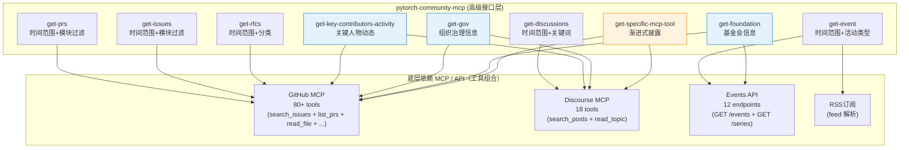

#  pytorch-community-mcp


## 背景

PyTorch开源社区的信息分布在多个地方。

- 代码、issue、pr
    - [https://github.com/pytorch/pytorch](https://github.com/pytorch/pytorch)
- RFC
    - [https://github.com/pytorch/rfcs](https://github.com/pytorch/rfcs)
- 官网信息
    - [https://pytorch.org/](https://pytorch.org/)
    - [https://github.com/pytorch/pytorch.github.io](https://github.com/pytorch/pytorch.github.io)
    - [https://github.com/pytorch-fdn](https://github.com/pytorch-fdn)
    - 接口
        - Events
            - api 接口文档：[https://pytorch.org/wp-json/tec/v1/docs](https://pytorch.org/wp-json/tec/v1/docs)
        - Blog & News
            - RSS订阅：[https://pytorch.org/feed/](https://pytorch.org/feed/)
- 开发者论坛
    - [https://discuss.pytorch.org/](https://discuss.pytorch.org/)

## 现状

Agent 要完整访问 PyTorch 社区全部信息必须同时加载多个核心 MCP（GitHub MCP、Discourse MCP）以及多个独立网络接口（Events API + RSS 订阅解析），总计超过 120 个工具。

- github mcp - 80-91个工具，取决于令牌配置

| **接口** | **描述** |
| --- | --- |
| mcp__github__add_comment_to_pending_review | 在当前用户已有的待提交 PR review 中添加代码评审评论。 |
| mcp__github__add_issue_comment | 给 issue 或 PR 添加普通评论。 |
| … | … |
- discourse mcp（查询开发者论坛用） - 18个工具

| 接口名称 | 描述 |
| --- | --- |
| discourse_search | 搜索主题、帖子（支持 Discourse 搜索语法） |
| discourse_read_topic | 读取主题详情及所有帖子（含 raw 内容） |
| … | … |
- event api接口 - 12个接口

| 接口名称 | 描述 |
| --- | --- |
| GET /events | 获取事件列表（支持 start_date、end_date、featured、virtual、geoloc 等过滤） |
| GET /series | 获取事件系列列表 |
| … | … |
- rss订阅

这些 MCP 均为各自领域的通用工具，并非专为 PyTorch 社区量身定制。因此，Agent 在读取社区信息时，通常仅需使用其中的少量接口。


### 庞杂的工具容易让Agent错误调用。

**用户查询**：“PyTorch 最近有哪些重要的 RFC 或重大特性提案？我想看看 Torch 的分布式训练优化方向。”

**Agent 错误调用路径**：

1. 决定使用 github_mcp 的 search_issues 或 search_code 工具。
2. 默认 pytorch/pytorch 主仓库（因为这是最知名的 repo）。
3. 查询关键词 “RFC” 或 “distributed training RFC”，结果只返回主仓库里零星的 issue/PR 讨论，而完全忽略 pytorch/rfcs 仓库中正式的 RFC 文档。

**用户查询**：“PyTorch 接下来 3 个月有哪些开发者会议、社区活动或线上研讨会？”

**Agent 错误调用路径**：

1. 优先想到论坛 → 调用 discourse_mcp 的 search_posts，关键词 “event / conference / meeting”。
2. 完全忽略官网 Events API（https://pytorch.org/wp-json/tec/v1/events），也可能漏掉 Blog RSS 中的活动预告。
3. 结果：只返回 discuss.pytorch.org 上用户零星讨论，而错过官方的 PyTorch Conference、Developer Day、TorchConf 等结构化活动（这些活动有明确的 start_date、location、registration_link）。

### 上下文膨胀、污染

- 获取PyTorch信息时，只涉及小部分工具，很多工具都无需使用。120+ 个工具描述仍会占据大量上下文窗口，加剧了Agent对工具解析的难度，导致 Agent 性能下降。
- 各个mcp返回的信息格式也不同，Agent从各个mcp拿到的信息有的是markdown，有的是json，造成Agent解析力下降。例如，github mcp 通常返回结构化 JSON，而其他 MCP 可能返回不同格式。

## pytorch-community-mcp

为了解决上述问题， pytorch-community-mcp 的核心目的是让 Agent 能够更容易、更准确地获取 PyTorch 社区的信息。具体而言，我们从各个 MCP 和 API 中抽取接口，仅保留最适合读取 PyTorch 社区信息的部分，并对部分工具进行组合优化，使 Agent 能够更轻松直接地获得社区信息，同时统一返回数据的格式。


### 接口设计

基于github mcp、discourse mcp，专门设计获取社区动态的mcp，相关接口如下。

```python
# 获取一段时间内的pr，可指定模块
get-prs

# 获取一段时间内的issue，可指定模块
get-issues

# 获取一段时间的rfc，包括PyTorch官方仓和rfc仓
get-rfcs

# 获取一段时间内的关键人物的动态，包括github、开发者论坛。
get-key-contributors-activity

# 获取一段时间内的开发者论坛动态
get-discussions

# 获取组织、治理信息
get-gov

# 获取基金会信息
get-foundation

# 获取官网事件、活动信息
get-event

# 按需暴露更多底层 MCP 工具，例如github mcp
get-specific-mcp-tool
```


### 使用前后对比

#### 对于Agent

| 维度 | 使用前 | 使用后 |
| --- | --- | --- |
| **上下文长度** | 加载 90+ 个无关工具描述，窗口膨胀严重 | 仅暴露 10-15 个语义清晰的高级工具，上下文精简。 |
| **错误风险** | 高：易误选仓库/工具（如 RFC 搜成主仓库 issue）、格式解析失败、遗漏官方来源 | 低：工具已预筛选 PyTorch 专属数据源 + 统一返回格式。 |
| **返回格式** | 混合 Markdown / JSON / 纯文本，解析负担重 | 全部标准化为 **Markdown + 结构化摘要 JSON**（含 summary、key_points、source_links） |

#### 对于开发者

使用前：部署github mcp + 部署discourse mcp + 手动prompt Agent读取官网api

使用后：部署pytorch-community-mcp
## TODO List

- [ ]  开发PyTorch Activity MCP
- [ ]  沉淀PyTorch Activity MCP开发经验，便于scale到其他开源项目。

## 合规

仅限内部使用。仅获取公开信息。