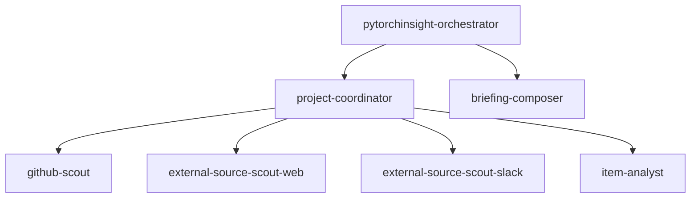
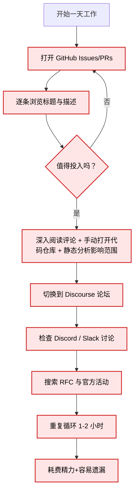
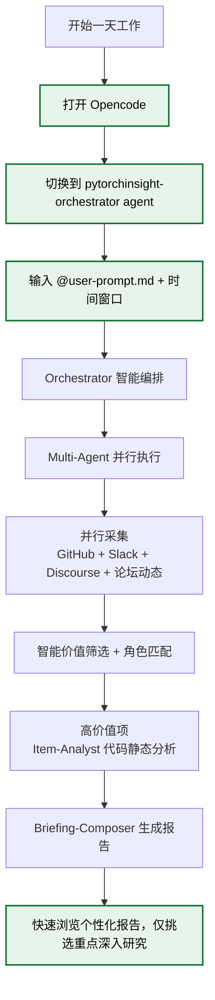

## 背景

当前，PyTorch开源社区每天产生海量动态，分布于GitHub主仓库、Discourse论坛、Discord/Slack频道、PyTorch基金会官网、社区核心开发者的个人动态、邮件列表等多个信息源。参与开源PyTorch团队的开发者获取这些上游信息的主要方式仍高度依赖手动操作。

## 现状

1. pytorch团队核心开发者。需要关注社区核心开发者的动态、关于社区演进方向的讨论、官方活动、基金会的动态等等。
    1. 痛点：每日海量PR/Issue/RFC/开发者论坛（Discourse、Discord、GitHub Discussions）产生，逐一全量浏览耗时耗力，在这个过程中也易错过高价值信号。
2. pytorch团队开发者。关注微观，需要尽快在参与到社区中、在特定模块构建自己的影响力。
    1. 痛点同上，另外缺少对问题“品味”的能力，不知哪些Issue/RFC投入产出比最高、哪些动态隐藏机会。

## 解决方案

1. 在Opencode基础上，开发multi-agent+skill的社区动态分析agent。


## 社区动态agent

在Opencode基础上，扩展agent skill + multi-agent协作系统。根据用户对自己角色、需求、价值的描述，让opencode自动分析在一个开源社区的一定时间内（例如一天、一周）对这个用户高价值的动态，必要的时候深入代码静态分，最后生成个性化社区动态报告。

### 竟品分析

github copilot、grok能部分缓解，但是它们上下文窗口有限，即使付费订阅，也会因为受限于单次对话的行动步数和rate limit，同时也不支持在一个大任务中深入到具体pr、issue所涉及代码的分析。

### 难点

1. 信息高召回率与模型上下文窗口有限的矛盾。
2. 爬取PyTorch官网时数据的低效问题与信息稀疏问题。

### 工作流

1. 用户打开opencode，按tab切换到pytorchinsight-orchestrator agent，输入

```jsx
@user-prompt.md + 时间窗口
```

其中user-prompt.md是用户自己配置的个性化prompt文件，描述自身角色、需求、价值判断标准。

1. opencode通过以下multi-agent拓扑完



以pytorch为例：

- `pytorchinsight-orchestrator` 负责输入、编排subagent、输出。首先读取原始用户 prompt。根据用户指定的pytorch项目，调用 `project-coordinator` 负责pytorch项目信息的获取。
- `project-coordinator`
    - 首先调用各个信息搜寻subagent收集项目动态，例如github-scout subagent通过github cli、github mcp等工具收集github上的动态；external-source-scout-slack subagent收集slack上的动态，结果是过滤掉无用、噪声信息，将信息组织好返回给`project-coordinator`
    - 然后`project-coordinator` 进行价值判断、筛选出值得深度研究高价值的动态项，对每个项目分配一个item-analyst subagent进行深度研究
    - item-analyst subagent 对一条动态进行深度研究；例如对可能影响到用户侧api的变化，其会通过静态分析torch和torch-npu的源码来研究出影响范围。
- `project-coordinator` 收集item-analyst subagent 的信息进行汇总返回给主agent `pytorchinsight-orchestrator` ，`pytorchinsight-orchestrator` 再根据用户的偏好输出，利用briefing-composer subagent 配合相关的输出skill将信息总结成用户希望的形式（例如html格式的文件、slack通知等）。

### 各个agent的职责

- pytorchinsight-orchestrator：唯一主入口，编排各个subagent工作流，输入处理与输出；调用project-coordinator获得项目级动态，并交给briefing-compose拿到最终交付数据，按指定形式输出。
- project-coordinator：项目级subagent，负责pytorch项目级信息处理，通过调用scouts拿到初步过滤的动态，筛选出值得深入分析的动态交给 item-analyst深入分析。
- scouts：单个信源的信息搜集subagent，例如pytorch issue动态的获取，进行初步过滤，交回给project-coordinator
- item-analyst：只服务于单项目协调器，通过结合静态代码深入分析单条动态，将分析结果交付回project-coordinator
- briefing-composer：成稿层subagent，调用front-designskill将所有动态信息组织成美观的报告，交付回pytorchinsight-orchestrator。

### 使用本产品前后对比

使用前的workflow



使用后：


