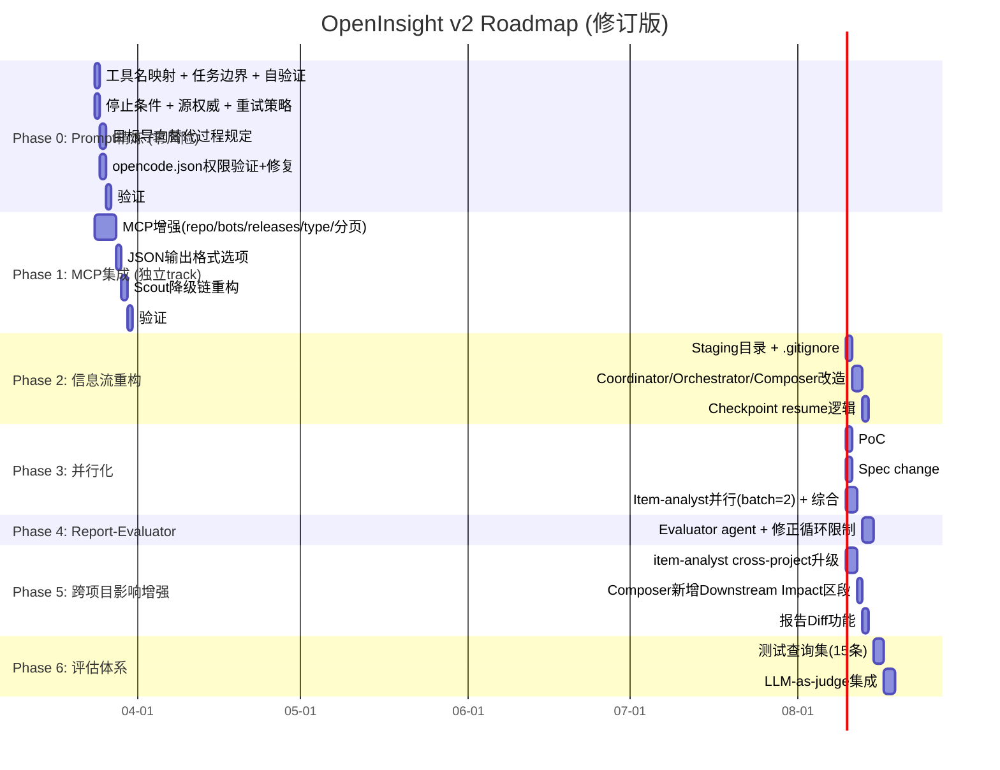

# OpenInsight Multi-Agent System v2 Plan

> 基于 Anthropic 工程博客范式评估（5 评估 agent）+ 5 审查 agent 反馈修订。
>
> 初版: 2026-03-20 | 修订: 2026-03-23

---

## 核心价值主张（重新定义）

系统的核心价值不是"采集社区动态"，而是：

> **告诉我这个上游变更对 torch-npu 意味着什么，省去我手动 fetch/import/debug 的时间。**

这决定了所有设计优先级：跨项目影响分析是核心路径，不是可选功能。

---

## 一、现状诊断

### 当前架构

```
orchestrator (primary, temp=0.3)
  → project-coordinator (subagent, temp=0.4)
      → github-scout (subagent, temp=0.1, parallel)
      → external-source-scout-web (subagent, temp=0.1, parallel)
      → external-source-scout-slack (subagent, temp=0.1, parallel)
      → item-analyst (subagent, temp=0.5, sequential x N=5)
  → briefing-composer (subagent, temp=0.6)
```

### 范式差距（审查后修订）

| # | 差距 | 影响 | 审查发现 |
|---|------|------|---------|
| 1 | **MCP 9 工具完全未集成** | 致命 | MCP 代码审查确认：hardcoded repo、无分页、Markdown 输出非结构化 |
| 2 | **对话中继 ~51K tokens** | 严重 | Token 审查修正：orchestrator 层节省 ~51K，但 evaluator 新增 ~38K+ |
| 3 | **无恢复能力** | 严重 | 实施审查确认可行，但需解决 staging 命名和并发隔离 |
| 4 | **item-analyst 串行瓶颈** | 高 | 对抗审查发现：并行化违反现有 openspec SHALL 要求，需 spec change |
| 5 | **无停止条件** | 高 | item-analyst 跨项目搜索无 budget，有无限循环风险 |
| 6 | **无评估循环** | 高 | Token 审查指出 evaluator 成本 ~38K-111K；用户选择默认开启 |
| 7 | ~~固定拓扑无路由~~ | ~~删除~~ | UX 审查：用户从不发快速查询，routing 解决不存在的问题 |

### 当前优势（保留不变）

- Temperature 梯度设计（0.1 → 0.3 → 0.4 → 0.5 → 0.6）
- Scout 三层 Token 预算协议（Layer 1/2/3）
- item-analyst 结构化 YAML 输出规范
- 降级链概念（但需重构为 MCP 优先）
- Agent 角色分离和 Intent-Based Description

---

## 二、改造方案

### Phase 0: Prompt 精炼（零风险，立即执行）

**原因**: 对抗性审查指出：Plan 引用 "simplicity first" 却一次性引入 10+ 新机制。应先做零风险的 prompt 改进，再考虑架构变更。这些是纯 prompt 修改，不改变运行时、不改变数据流、不依赖任何外部变更。

#### 0.1 显式工具名映射

所有 scout 新增精确的工具名和参数。当前 scout 引用不存在的工具名（如 github-scout 映射 Discussions → `search_code`，实际应为 Discourse MCP 工具），且完全忽略 pytorch-community MCP。

```markdown
### 工具优先级（github-scout 示例）
1. `mcp__pytorch-community__get_prs(since, until, module, state, max_results)` — 首选
2. `mcp__pytorch-community__get_issues(since, until, module, state, max_results)` — 首选
3. `mcp__pytorch-community__get_rfcs(since, status)` — 首选（覆盖 pytorch/rfcs 仓库）
4. `mcp__github__list_pull_requests(owner, repo, state)` — 回退
5. Bash `gh pr list --repo ... --json ...` — 末选
```

#### 0.2 显式任务边界（MUST NOT 清单）

| Agent | MUST NOT |
|-------|----------|
| orchestrator | 自行采集数据或执行分析 |
| coordinator | 自行 fetch 数据（通过 scout）；生成最终报告；编造 scout 未返回的数据 |
| scouts | 执行价值判断或分析；summary 超过 50 字 |
| item-analyst | 修改源代码；分析未分配的 item；超出 effort budget 继续搜索 |
| composer | 重新分析 item；裁剪分类动态列表；自造 URL |

#### 0.3 目标导向替代过程规定

替换 item-analyst 3.5-3.7 节（~80 行 git 命令 runbook）为 ~20 行目标导向指引：

```markdown
### 代码访问策略

**目标**: 在指定 git ref 上读取源代码进行静态分析。

**方法**: 使用 `{repo_cache_dir}/{repo_short}.git` bare clone + `git worktree` 检出。

**约束**:
- 首次 clone 使用 `--single-branch` 减少磁盘占用
- 按需 fetch 其他分支
- 分析完成后（无论成功失败）必须清理 worktree
- 永不删除 bare clone 本身

**失败处理**: 任何 git 操作失败 → 记录错误 → 跳过代码级分析 → `analysis_depth: surface`
```

#### 0.4 自验证步骤

| Agent | 自验证 |
|-------|--------|
| item-analyst | 返回前检查所有必填 YAML 字段；若 `analysis_depth=cross-project` 则验证 `impact_chain` 存在 |
| composer | 写入前验证 HTML 5 个区段齐全、URL 来自源数据而非自造 |
| coordinator | 融合后验证去重统计一致性（`before ≥ after`，`merge_count = before - after`） |

#### 0.5 停止条件（Effort Budget）

| Agent | Budget |
|-------|--------|
| item-analyst | 代码搜索：每个仓库 max 10 次 grep，max 20 次文件读取。跨项目追踪：每个 downstream repo max 5 个文件深入读取。超限返回部分结果并标注 `budget_reached: true` |
| github-scout | max 15 次 tool call |
| web-scout | 每个源 max 5 次 WebFetch 尝试 |
| coordinator | 若 Phase 3 累计超过 10 分钟，跳过剩余 item，汇总已完成的分析 |
| orchestrator | coordinator 超时 15 分钟 → 中止并报告；composer 超时 5 分钟 → 直接输出 coordinator 文本结果 |

#### 0.6 源权威层级（自然语言，非数值系数）

对抗审查指出数值系数（1.0/0.8/0.6）是 premature abstraction。改为自然语言引导：

```markdown
### 源权威优先级
价值评估时，优先使用一手数据（GitHub PR/Issue/Release、官方 RFC）作为 canonical item。
博客文章或 Slack 讨论引用同一 PR 时，PR 为主条目，其余为补充上下文。
不要让转述类内容（blog recap、Slack 讨论）在排名中压过其原始源。
```

#### 0.7 重试优先于降级

```markdown
### 重试策略（所有 Scout）
在触发降级之前，对当前层级至少重试 1 次（间隔 5 秒）。
仅在连续 2 次失败后才降级到下一层级。
```

#### 0.8 opencode.json 工具权限修复

> ⚠️ 注意：对抗审查指出当前系统正常运行，说明权限可能是 permissive-by-default。修改前需验证默认行为，避免破坏已有功能。

验证后更新：
```json
{
  "tools": {
    "pytorch-community*": true,
    "mcp__github__*": true,
    "mcp__slack__*": true
  }
}
```

---

### Phase 1: MCP 集成（解耦为独立 track）

**原因**: pytorch-community MCP 提供 9 个工具，0 个被使用。但 MCP 代码审查发现问题比 Plan 预期更多。

> ⚠️ 前置条件：MCP 是独立代码库（`/Users/chu/project/openinsight_mcp`），修改周期独立于 agent prompt。Phase 0 可以先落地，Phase 1 独立推进。

#### 1.1 MCP 增强（修订后的完整列表）

MCP 代码审查发现的实际工作量（2 天 → 3-4 天）：

| 增强项 | 涉及文件 | 工作量 | 优先级 |
|--------|---------|--------|--------|
| `get_prs`/`get_issues`/`get_commits` 添加 `repo` 参数 | `prs.py:36`, `issues.py:36`, `commits.py:54`, `server.py` x3 | 3-4h | 必须 |
| `contributors.py` 也硬编码了 pytorch/pytorch（Plan 遗漏） | `contributors.py:93,108` | 1h | 必须 |
| `exclude_bots` 参数（query-level，需注意 GitHub Search 256 字符限制） | `prs.py`, `issues.py` | 1-2h | 必须 |
| `get_releases` 新工具 | 新增 `releases.py` + `GitHubClient.get_releases()` + `server.py` | 3-4h | 必须 |
| `comments` 计数字段 | `prs.py:67`, `issues.py:66` 各加 1 行 | 30min | 重要 |
| `type` 字段（PR/Issue/Discussion/Release）— Plan 遗漏 | `prs.py`, `issues.py`, `releases.py` 输出 dict | 30min | 重要 |
| `get_github_discussions`（需 GraphQL client）| 新增 GraphQL client + `discussions_github.py` | 4-6h | 推迟 |
| Discourse/Slack/Events 分页支持 — Plan 遗漏 | `discussions.py`, `slack.py`, `events.py` | 3-4h | 重要 |
| Slack client HTTP status 检查 — Plan 遗漏 | `slack.py:73` | 30min | 重要 |
| JSON 输出格式选项（当前仅 Markdown）— Plan 遗漏 | `formatter.py` 新增 `format` 参数 | 2-3h | 必须 |

**工期修订**: 3-4 天（不含 `get_github_discussions`，该项推迟到后续迭代）。

#### 1.2 Scout 降级链重构

Phase 0.1 的工具映射生效后，更新实际降级链：

```
github-scout:
  1. pytorch-community MCP (get_prs, get_issues, get_rfcs, get_releases)
  2. GitHub MCP (api.githubcopilot.com)
  3. gh CLI

web-scout:
  1. pytorch-community MCP (get_discussions, get_blog_news, get_events)
  2. WebFetch

slack-scout:
  1. pytorch-community MCP (get_slack_threads) ← 当前即可用
  2. Slack Docker MCP (disabled)
```

#### 1.3 新增数据维度

| MCP 工具 | 新能力 | 消费方 | 用户价值 |
|----------|--------|--------|---------|
| `get_commits` | PR merge 上下文、模块变更速率 | item-analyst | 中 |
| `get_key_contributors_activity` | 跨平台贡献者画像 | item-analyst (person_pattern) | 中高 |
| `get_rfcs`（搜索 pytorch/rfcs 仓库） | 当前完全遗漏的 RFC 源 | github-scout | 高 |
| ~~`get_events`~~ | ~~社区活动日历~~ | ~~composer~~ | ~~低（UX 审查建议推迟）~~ |

---

### Phase 2: 信息流重构 — Artifact-Based Output

**原因**: Anthropic 推荐 "subagents store work in external systems, pass lightweight references back"。

> ⚠️ 实施审查确认：OpenCode subagent 有文件读写权限（composer 已在写 HTML）。Staging 可行。

#### 2.1 Staging 目录

```
reports/.staging/{project}_{date}_{time_window}/
  ├── phase1_github.md          # GitHub scout 结果（独立文件避免并行写竞争）
  ├── phase1_web.md             # Web scout 结果
  ├── phase1_slack.md           # Slack scout 结果
  ├── phase2_fusion.md          # 融合后全量数据
  ├── phase3_item_{n}.md        # 每个 item-analyst 结果
  ├── wisdom.md                 # Wisdom notepad
  └── coordinator_result.md     # Coordinator 最终输出
```

**审查修正**:
- Scouts 写独立文件（`phase1_github.md`, `phase1_web.md`, `phase1_slack.md`）而非共享文件，**消除并行写竞争风险**
- 命名使用 `{project}_{date}_{time_window}`（如 `pytorch_2026-03-20_7d`），不含 `run_id`，使相同查询的 resume 自动生效
- `.gitignore` 添加 `reports/.staging/`

#### 2.2 数据流变化

**Before（对话中继）**:
```
coordinator --[~15K 全量]--> orchestrator --[~16K 转发]--> composer --[~20K HTML]--> orchestrator
Orchestrator 累积 context: ~37K
```

**After（文件引用）**:
```
coordinator --写入--> staging/coordinator_result.md
coordinator --[~100 tokens: 路径 + 统计]--> orchestrator --[~200 tokens]--> composer
composer --读取 staging 文件--> 写入 reports/output.html --[~50 tokens 确认]--> orchestrator
Orchestrator 累积 context: ~2.5K
```

**诚实的 Token 经济表**（审查修正后）:

| 组件 | v1 Tokens | v2 Tokens | 变化 | 换来了什么 |
|------|-----------|-----------|------|-----------|
| Orchestrator 中继（input+output） | ~51K | ~0.5K | **-51K** | Context window 压力消除 |
| Composer 读数据 | ~15K (消息) | ~15K (文件读) | 0 | 传输方式变化，总量不变 |
| Wisdom 综合（新增） | 0 | ~15-18K | **+15-18K** | 并行化的代价 |
| Report-evaluator（默认开启） | 0 | ~38K (pass) / ~111K (1次fail) | **+38K ~ +111K** | 报告质量保证 |
| 新 MCP 数据 (commits, contributors) | 0 | ~5-8K | **+5-8K** | 数据覆盖提升 |
| **净效果（evaluator 1-pass）** | baseline | | **约 +7K (+5%)** | 质量+覆盖+速度，总token持平 |
| **净效果（evaluator fail 1次）** | baseline | | **约 +80K (+50%)** | 同上，质量代价更高 |

> 关键认知：v2 不是 token 节省方案，而是 **token 重分配方案** — 从无用的中继转移到有价值的评估和新数据。真正的用户收益是 **时间**（并行化）和 **质量**（evaluator + 更好的数据覆盖）。

#### 2.3 Checkpoint Resume

Staging 目录天然成为 checkpoint。Orchestrator 新增：

```markdown
### 断点续传

调用 coordinator 前，检查 staging 目录 `reports/.staging/{project}_{date}_{time_window}/`：
- 若 `coordinator_result.md` 存在且完整 → 输出 "⚡ 发现已完成的分析，跳过采集和分析阶段" → 直接调 composer
- 若 `phase1_*.md` 部分存在 → 通知 coordinator 仅采集缺失的源
- 若 `phase3_item_*.md` 部分存在 → 通知 coordinator 仅分析缺失的 item
- 若无任何 staging 文件 → 正常全流程

用户若需强制重跑，手动删除 staging 目录即可。
```

---

### Phase 3: 并行化 — Item-Analyst

> ⚠️ **前置条件**（对抗审查 + 实施审查联合发现）：
> 1. **Spec Change**: `openspec/specs/agent-orchestration/spec.md` 的 wisdom notepad 顺序传递是 SHALL 要求。必须先提交 spec change（将 SHALL 改为 "MAY, depending on parallelization mode"）
> 2. **PoC 验证**: 确认 coordinator (subagent) 能否并行调用 item-analyst (subagent)。OpenCode 的 `task` 权限对 subagent 是 deny 的，需验证 `session()` 机制是否不受此限制
> 3. **并发上限**: CLAUDE.md 建议并发 ≤ 2。N=5 并行可能超限，需考虑分批（batch of 2）

#### 3.1 并行 Item-Analyst + 事后综合

```markdown
### Phase 3: 深度分析（并行模式）

1. 将高价值项分为 batch（每 batch ≤ 2 个 item，遵守并发建议）
2. 每个 batch 内的 item-analyst 并行启动
   - 不接收 wisdom notepad（打破顺序依赖）
   - 结果写入 staging/phase3_item_{n}.md

3. 所有 batch 完成后，执行**跨动态综合**（coordinator 自身执行）：
   - 读取所有 phase3_item_*.md
   - 识别：相同作者跨 PR 模式、相同模块密集变更、PR 间引用关系
   - 特别关注：对 torch-npu 有 cross-project impact 的 item 之间的关联
   - 生成 wisdom summary → staging/wisdom.md
```

**预期收益**: N=5 串行 ~10 分钟 → 3 批次(2+2+1) ~4-5 分钟 + 综合 ~1 分钟 ≈ **~5-6 分钟（-40~50%）**。

> 注：保守估计而非 Plan v1 的 "-70%"（对抗审查指出该数字未经日志验证）。

#### 3.2 动态 N

```markdown
### 高价值项数量

根据融合结果动态决定 N：
- 融合后 ≤ 10 条: N = min(2, 总数)
- 融合后 11-30 条: N = 3-5（取分数断层以上）
- 融合后 > 30 条: N = 5-7
- 融合后 0 条: N = 0，跳过 Phase 3，返回"无显著活动"
```

#### 3.3 Scout 按需裁剪

```markdown
### Scout 可用性预检
- 检查 project_config 数据源列表 → 仅调度有配置的 scout
- 检查 Slack MCP 可用性 → 不可用则跳过，节省 subagent 开销
- 记录跳过的 scout 及原因
```

---

### Phase 4: Report-Evaluator（默认开启）

**用户选择**: 质量优先，接受 token 代价。

```markdown
# .opencode/agents/report-evaluator.md
---
description: "Quality gate agent — validates report completeness, citation accuracy,
  and spec compliance. Evaluation intent."
mode: subagent
temperature: 0.2
---

## 评估维度（checklist，非 LLM 推理）

1. ☐ 5 个必需区段（Executive Summary / 高价值详情 / 跨动态洞察 / 分类列表 / 数据源状态）是否齐全
2. ☐ 分类动态列表条目数 ≥ coordinator 返回的 fusion 后条目数
3. ☐ Executive Summary 引用了 GitHub 源（若 coordinator 数据含 GitHub 条目）
4. ☐ 所有 URL 格式合法（不含 hallucinated URL）
5. ☐ 数据统计与 coordinator 数据一致

## 控制
- 最多修正 1 次。若第 2 次评估仍 fail → 交付当前版本 + 附注问题列表
- 评估 budget: ≤ 30 秒
```

**Orchestrator 流程**:
```
coordinator → composer → evaluator
  → pass → 交付
  → fail → composer 修正（仅 1 次机会）→ 交付（附注评估结果）
```

> 修正循环限制为 1 次，消除对抗审查指出的无限循环风险。

---

### Phase 5: 跨项目影响分析增强（核心价值）

**原因**: 用户的核心需求是 "这个 PR 对 torch-npu 意味着什么"。当前 item-analyst 已有 cross-project impact tracing（3.7 节），但它是 "条件执行" 的次要功能。应升级为核心路径。

#### 5.1 增强 item-analyst 的 cross-project 分析

```markdown
### 跨项目影响分析（核心功能）

当 project_config 存在 `role: downstream` 的仓库时：

**对每个高价值项**，无论其是否直接涉及下游 API：
1. 提取 changed APIs、changed modules、changed behavior
2. 在每个 downstream repo 中搜索使用情况
3. 推理影响程度：
   - API 签名变更 → torch-npu C++ 编译是否会 break？
   - 行为变更 → torch-npu 的 override/patch 是否仍然正确？
   - 新增 API → torch-npu 是否需要新增适配？
4. 输出具体的文件:行号和风险等级

**分析深度由 impact 决定，不由类型决定**：
即使一个 PR 看起来只是 "文档更新"，如果它修改了 torch/distributed 的接口文档，
也可能意味着行为变更。总是检查 diff 涉及的文件路径。
```

#### 5.2 Briefing-Composer 新增 "Downstream Impact" 区段

在报告 5 个区段之外新增第 6 区段（或在 Executive Summary 中重点呈现）：

```markdown
### 6. 下游影响评估（Downstream Impact）

对每个有 cross-project 影响的高价值项：
- 🔴 高风险：API 签名变更，torch-npu 编译可能失败
  - PR #XXXXX: `ProcessGroup.allreduce()` 签名变更
  - 影响文件：torch_npu/csrc/distributed/xxx.cpp:123
  - 建议：立即适配
- 🟡 中风险：行为变更，需验证
  - ...
- 🟢 无影响：已检查，未发现下游依赖
  - ...
```

#### 5.3 报告 Diff（与上次报告对比）

```markdown
### 报告 Diff（可选区段）

若 staging 目录中存在前一次运行的 coordinator_result.md：
- 新增 item：本次出现但上次未出现的条目
- 升级 item：impact_level 从 low → medium 或 medium → high
- 已解决 item：上次出现但本次消失的条目（PR merged/Issue closed）
```

---

### Phase 6: 评估体系

#### 6.1 测试查询集（15 条，审查后精简）

删除了 "快速查询" 和 "摘要扫描" 相关测试（routing 已移除）。

| 维度 | 查询 | 验证目标 |
|------|------|---------|
| 窄时间窗 | pytorch 最近 1 天 | 正常运行，可能较少数据 |
| 标准时间窗 | pytorch 最近 3 天 | 标准场景 |
| 宽时间窗 | pytorch 最近 7 天 | 数据量大，token 压力 |
| torch-npu 项目 | torch-npu 最近 7 天 | 不同项目配置 |
| 空数据期 | pytorch 2020-01-01 到 2020-01-02 | 零结果优雅处理 |
| 降级场景 | (disable GitHub MCP) pytorch 3 天 | 降级链是否工作 |
| 核心开发者 | user-prompt-core-dev.md pytorch 7 天 | 角色适配 |
| 普通开发者 | 另一个 user-prompt pytorch 7 天 | 角色适配 |
| 跨项目影响 | pytorch 7 天（含 torch-npu downstream） | cross-project 分析质量 |
| 并发 | 2 路并发 opencode serve | 稳定性 |

#### 6.2 LLM-as-Judge

运行后自动评估（使用 report-evaluator agent）：
- 事实准确性 (0-1)
- 引用准确性 (0-1)
- 完整性 (0-1)
- 下游影响覆盖度 (0-1)：cross-project impact 是否涵盖关键 PR

---

## 三、实施路线图



**关键变化**:
- Phase 0（prompt 精炼）移到最前面，0 天依赖
- Phase 1（MCP）独立 track，不阻塞其他 Phase
- Phase 3 前置 PoC + Spec change
- Phase 5（跨项目影响增强）新增，对齐核心价值主张
- ~~Phase 2.1 (routing)~~ 删除

---

## 四、v2 目标架构

```
orchestrator (primary, temp=0.3)
  └── [深度报告] → coordinator (完整模式)
        ├── Scout可用性预检
        ├── Phase 1: Scouts (parallel, pytorch-community MCP 优先)
        │     ├── github-scout → staging/phase1_github.md
        │     ├── web-scout → staging/phase1_web.md
        │     └── slack-scout → staging/phase1_slack.md
        ├── Phase 2: 融合验证 + 源权威优先级 → staging/phase2_fusion.md
        ├── Phase 3: Item-analysts (batch of 2, parallel within batch)
        │     ├── analyst-1 → staging/phase3_item_1.md  (含 cross-project impact)
        │     ├── analyst-2 → staging/phase3_item_2.md
        │     └── ...
        ├── Phase 3.5: 跨动态综合 → staging/wisdom.md
        └── 汇总 → staging/coordinator_result.md (文件引用返回)

        → composer → reports/output.html (含 Downstream Impact 区段)
        → report-evaluator → pass/fail
        → (若 fail, max 1次) composer 修正 → 交付
```

---

## 五、风险与缓解（审查后修订）

| 风险 | 概率 | 影响 | 缓解 | 来源 |
|------|------|------|------|------|
| coordinator 无法并行调用 item-analyst（subagent 权限） | 中 | 高 | Phase 3 前置 PoC；若失败则保持串行或将调用上移到 orchestrator | 实施审查 |
| MCP 增强延期（独立代码库） | 中 | 中 | Phase 0 不依赖 MCP；工具映射先指向 MCP，降级到 GitHub MCP/gh CLI | 对抗审查 |
| 并行 wisdom 质量下降 | 低 | 中 | 事后综合补偿；Spec change 保留 "MAY use sequential" 选项 | 对抗审查 |
| Report-evaluator token 成本过高（fail 场景 +111K） | 中 | 中 | 最多修正 1 次；evaluator 用 checklist 模式而非深度推理 | Token 审查 |
| Staging 文件与并发运行冲突 | 低 | 中 | 命名含 time_window，不同查询自然隔离 | 实施审查 |
| 回滚需求 | 低 | 中 | 所有 agent 变更在 git 中，`git revert` 即可；MCP 变更向后兼容（参数有默认值）| 对抗审查 |

---

## 六、前置验证项（在投入全面实施前完成）

| 验证项 | 方法 | 阻塞的 Phase |
|--------|------|-------------|
| 1. OpenCode subagent 并行调用能力 | 写一个最小 coordinator → 2 个 dummy subagent PoC | Phase 3 |
| 2. OpenCode 权限默认行为 | 检查当前 opencode.json tools pattern 不匹配时是否 allow-all | Phase 0.8 |
| 3. 日志分析：Phase 3 实际耗时占比 | 对最近 3 次运行提取 session 时间线 | Phase 3 优先级确认 |
| 4. MCP 启动状态 | 验证 pytorch-community MCP 是否能正常启动（实施审查发现有 Connection closed 错误）| Phase 1 |
